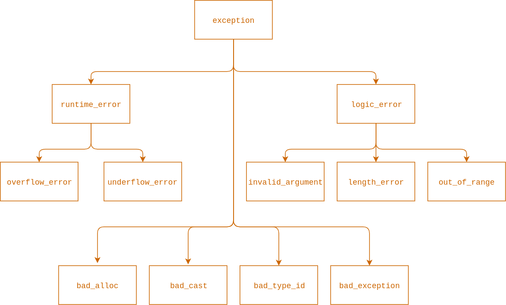

# Exceptions (Изключения)
Механизъм за улавяне на грешки (*изключителни* събития) и дефиниране на поведение за справяне с тях.

### [Задачи](#задачи)

## `try`
- Позволява създаването на блок от код, в рамките на който може да се хвърли изключение поради възникнал проблем по време на изпълнението му

## `throw`
- Хвърля изключение когато бъде засечен проблем
- Може да бъде хвърлян всякакъв тип, но рядко се ползват примитивните типове за тази цел
- Изключението трябва да дава информация за възникналия проблем

## `catch`
- Клауза, която служи за прихващането на изключение от даден тип
- Можем да имаме: 
  
| Съдържание на `catch`-клаузата | Обяснение |
| --- | --- |
| `(...)` | Всички изключения. |
| `std::exception` | Най-общия клас изключения. Всички останали стандартни изключения произлизат от него. |
| `std::logic_error` | Логическа грешка. |
| `std::invalid_argument` | Подаден невалиден аргумент на функция. |
| `std::out_of_range` | Индекс е извън обхавата на структура данни. |
| `std::runtime_error` | Грешка, която не можем да засечем четейки кода. |
| `std::overflow_error` | Препълване (например, ако резултатът от изчисление е твърде голям за типа, на който искаме да го присвоим). |

Пълен списък с изключенията можете да намерите [тук](https://www.tutorialspoint.com/cplusplus/cpp_exceptions_handling.htm)

## Йерархия
&nbsp;


## Примери

```cpp
#include <iostream>
#include <stdexcept>

double triangle_perimeter(double a, double b, double c)
{
    if (a <= 0 || b <= 0 || c <= 0)
    {
        throw std::invalid_argument("There are nonpositive sides of the triangle.");
    }

    return a + b + c;
}

int main()
{
    int a = 3, b = 4, c = 2;
    int perimeter = 0;

    try
    {
        perimeter = triangle_perimeter(a, b, c);
        std::cout << "The perimeter is: " << perimeter << '\n';
    }
    catch (std::invalid_argument &exception)
    {
        std::cout << exception.what() << '\n';
    }

    return 0;
}
```

## Задачи

1. Направете клас за касичка с капацитет до 300 броя стотинки. С нея трябва да могат да се извършват следните операции:
- Добавяне на стотинки
- Намиране на сумата в касичката
- Чупене на касичка (прави касичката неизползваема и връща сумата от нея)

2. Когато ползвате браузъра можете да се връщате назад в историята си като преминавате през всички сайтове, през които сте влизали. Реализирайте клас `Tab`, който Ви позволява да се движите между сайтовете, които сте посещавали със следните функции:
- `load` - по подаден `url` се зарежда нов сайт
- `back` - за връщане назад до последния сайт
- `forward` - за преминаване напред
